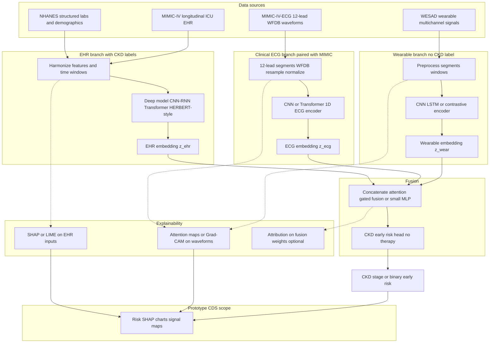

# Conceptual architecture diagram (copy into slides)

Paste the block below into Mermaid Live Editor, Notion, GitHub, or slide tools that support Mermaid.

## Export as PNG or SVG (recommended)

1. Open [Mermaid Live Editor](https://mermaid.live).
2. Replace the default diagram with the contents of [`architecture-diagram.mmd`](architecture-diagram.mmd) (same graph as below).
3. Use **Actions → PNG** or **SVG** to download an image for PowerPoint, Keynote, Google Slides, or LaTeX Beamer.

## Local CLI (optional)

If you have Node.js and a working Chromium (or set `PUPPETEER_EXECUTABLE_PATH` to your Chrome binary):  
`npx @mermaid-js/mermaid-cli -i architecture-diagram.mmd -o architecture-diagram.png`

